# ⚙️ Awesome Configuration Management SaaS 🚀

  
  
  
  
  

> **A curated, comprehensive directory of top Configuration Management SaaS platforms, Continuous Configuration tools, Desired State Automation, Infrastructure-as-Code (IaC), Compliance-as-Code, and Feature Flag systems.**

---

## 📌 Table of Contents

- [💡 Overview](#-overview)
- [🏢 SaaS & Hosted Platforms](#-saas--hosted-platforms)
- [🔓 Open-Source GitHub Projects](#-open-source-github-projects)
- [🤝 How to Contribute](#-how-to-contribute)
- [📈 Star History](#-star-history)
- [☕ Support & Community](#-support--community)
- [⚠️ Disclaimer](#%EF%B8%8F-disclaimer)

---

## 💡 Overview

Modern IT infrastructure and application delivery require **continuous configuration management** to maintain consistency, auditability, security, and automated desired-state enforcement across cloud, on-premises, and hybrid environments. 

This repository tracks market-leading **commercial SaaS platforms** alongside powerful **open-source automation tools**. Whether managing bare-metal fleets, Kubernetes clusters, continuous integration/deployment pipelines, feature flag rollouts, or compliance enforcement, this guide provides transparent pricing, free tier limits, company scale, and community metrics to inform architectural decisions.

---

## 🏢 SaaS & Hosted Platforms

> 📊 **Sector Market Analysis**: The global Configuration Management software market is estimated at **~$4.2 Billion (2026)** with a projected CAGR of **11.5%**. The sector is **moderately fragmented**—while enterprise IT conglomerates (Broadcom/VMware, IBM/Red Hat) dominate heavy server fleet governance, agile specialized SaaS providers (Harness, Octopus Deploy, ConfigCat) lead in continuous delivery, application-level configuration, and feature flag management.

Below is the curated list of major **Configuration Management SaaS platforms**, sorted by company size (valuation / market capitalization descending):

| Product / Platform 🌐 | Company & Size (Valuation / Revenue) 🏢 | Starting Tier Price 💳 | Free Tier / Trial Limits 🎁 |
| :--- | :--- | :--- | :--- |
| **[Salt Project Enterprise / VMware Aria](https://docs.saltproject.io/)** | **Broadcom / VMware** `~$750.0B Market Cap` (`$13.3B ARR`) | **$150.00** / OS instance / year | **30-day free trial** *(Up to 50 nodes with full automation capabilities)* |
| **[Red Hat Ansible Automation Platform](https://www.redhat.com/en/technologies/management/ansible)** | **IBM / Red Hat** `~$200.0B Market Cap` (`$3.4B ARR`) | **$1,750.00** / year *(Starter 100-node tier)* | **60-day free trial** *(Up to 100 nodes, full platform suite)* |
| **[Harness Continuous Configuration](https://www.harness.io/)** | **Harness Inc.** `~$3.7B Valuation` (`$100M+ ARR`) | **$100.00** / developer / month | **Free Forever plan** *(Includes 2 services, 1,000 build mins/mo, 100 deploy steps)* |
| **[Chef Automate](https://www.chef.io/)** | **Progress Software** `~$2.7B Market Cap` (`$700M+ Revenue`) | **$137.00** / node / year | **30-day free trial** *(Unlimited managed nodes during evaluation)* |
| **[Puppet Enterprise](https://www.puppet.com/)** | **Perforce Software** `~$2.0B Valuation` (`$500M+ Revenue`) | **$120.00** / node / year | **Free Forever** *(Up to 10 nodes with full Enterprise capabilities)* |
| **[Octopus Deploy](https://octopus.com/)** | **Octopus Deploy** `~$625M Valuation` (`$80M+ ARR`) | **$3.30** / target / month *($33/mo minimum)* | **Free Forever** *(Up to 10 deployment targets & 1,000 build mins/mo)* |
| **[ConfigCat](https://configcat.com/)** | **ConfigCat Ltd.** `~$15M Valuation` (`$3M+ ARR`) | **$99.00** / month *(Pro plan for 5M reqs)* | **Free Forever plan** *(10 feature flags, 5M requests/month, 10 team members)* |
| **[CFEngine Enterprise](https://cfengine.com/)** | **Northern.tech** `~$12M Valuation` (`$5M+ Revenue`) | **$24.00** / host / year | **Free Forever** *(Up to 25 hosts including Mission Portal dashboard)* |
| **[Rudder Enterprise](https://www.rudder.io/)** | **Normation SAS** `~$10M Valuation` (`$2.5M+ Revenue`) | **$16.00** / node / year *(Starter tier)* | **30-day free trial** *(Full Enterprise security suite)* |

---

## 🔓 Open-Source GitHub Projects

Configuration management boasts one of the most vibrant open-source ecosystems in software engineering. The projects below power mission-critical operations globally and are sorted by **GitHub Stars_Count** (descending):

1. 🥇 **[Ansible](https://github.com/ansible/ansible)**   
   *Radically simple, agentless IT automation, configuration management, application deployment, and orchestration engine using YAML playbooks over SSH/WinRM.*

2. 🥈 **[Terraform](https://github.com/hashicorp/terraform)**   
   *Industry-standard declarative Infrastructure-as-Code (IaC) tool to define, provision, and update cloud infrastructure state safely across providers.*

3. 🥉 **[OpenTofu](https://github.com/opentofu/opentofu)**   
   *Community-driven, open-source fork of Terraform managed under the Linux Foundation for open cloud state provisioning.*

4. 📦 **[chezmoi](https://github.com/twpayne/chezmoi)**   
   *Secure, cross-platform dotfile and workstation configuration management tool for multi-machine developer environments.*

5. ❄️ **[Nix](https://github.com/NixOS/nix)**   
   *Purely functional package management and system configuration system providing reproducible, declarative system builds.*

6. ⚡ **[Salt (SaltStack)](https://github.com/saltstack/salt)**   
   *High-speed, event-driven infrastructure configuration management, remote execution engine, and reactive state orchestration.*

7. 🚩 **[Unleash](https://github.com/Unleash/unleash)**   
   *Open-source enterprise feature flag and continuous application configuration management service.*

8. 🚀 **[Capistrano](https://github.com/capistrano/capistrano)**   
   *Remote server automation and application deployment framework executed via SSH scripts and Rake.*

9. 🔪 **[Chef Infra](https://github.com/chef/chef)**   
   *Ruby-based declarative infrastructure automation framework utilizing cookbooks and recipes for desired state configuration.*

10. 🐶 **[Puppet](https://github.com/puppetlabs/puppet)**   
    *Mature declarative desired-state configuration management system featuring custom DSL, autonomous agents, and drift correction.*

11. 🐍 **[pyinfra](https://github.com/pyinfra-dev/pyinfra)**   
    *Fast, agentless server automation engine that transforms Python scripts into state operations across SSH and Docker containers.*

12. 🛡️ **[InSpec](https://github.com/inspec/inspec)**   
    *Open-source compliance-as-code and security auditing framework paired with Chef and cloud infrastructure engines.*

13. 🏎️ **[Mitogen](https://github.com/mitogen-hq/mitogen)**   
    *High-performance Python library for zero-footprint distributed execution, dramatically accelerating Ansible playbook performance.*

14. 🛠️ **[Rudder Core](https://github.com/Normation/rudder)**   
    *Continuous configuration and compliance management platform with centralized Web UI and automated policy auditing.*

15. 🤖 **[CFEngine Core](https://github.com/cfengine/core)**   
    *Ultra-lightweight, autonomous C-based desired state enforcement agent for large-scale and edge server infrastructure.*

---

## 🤝 How to Contribute

Contributions from the community are warmly welcomed! Help keep this ecosystem reference up-to-date and accurate:

1. 🍴 **Fork** this repository.
2. 📝 **Add/Update** entries in `README.md` keeping formatting consistent.
3. 🔎 Ensure SaaS additions include explicit **pricing**, **free tier limits**, and **company scale**.
4. 📬 Submit a **Pull Request** with a clear explanation of changes.

---

## 📈 Star History

---

## ☕ Support & Community

Thank you for exploring **Awesome Configuration Management SaaS**! If you find this repository valuable for your DevOps, SRE, or infrastructure automation workflows, please consider supporting:

- ⭐ **Star this repository** to help others discover it on GitHub.
- 🔀 **Fork & Share** with your colleagues and engineering teams.
- 💬 **Join our community on [Discord](https://discord.gg/jc4xtF58Ve)** for discussions and recommendations.
- 💖 **Sponsor the Maintainer**: Consider buying a coffee on the [GitHub Sponsor Dashboard](https://github.com/sponsors/ishandutta2007).

---

## ⚠️ Disclaimer

- This list is **community-curated** for informational purposes. Product pricing, valuations, and free tier limits change frequently; please consult official vendor websites for binding commercial quotes.
- Configuration management tools operate with root/elevated access on production systems. Thoroughly audit and test playbooks/recipes in non-production environments prior to fleet-wide deployment.
